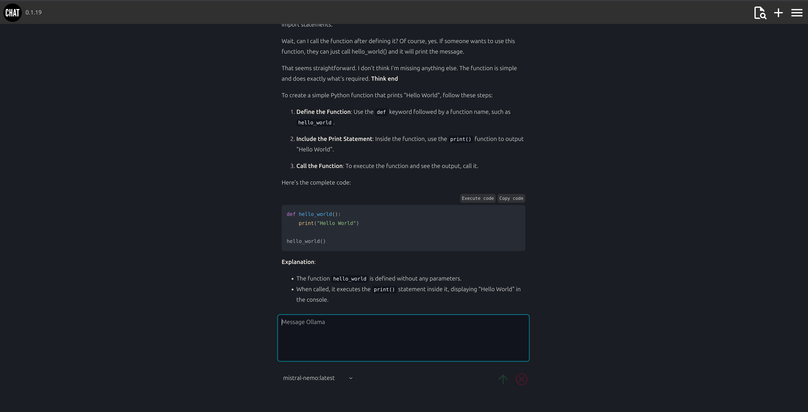

# Ollama client

A simple multi-user HTML or web client for the Ollama API.

[](docs/screenshot.png)

## Requirements

You will need an instance of the ollama service running.

## Features

* user authentication and registration
* user profile
* dark and light mode
* user dialog history
* user dialog management (delete dialogs)
* copy dialog message to clipboard
* load and continue saved dialogs
* tool support (if enabled)
* python execution (if enabled)

## Installation using pipx

Install latest version of ollama-client globaly:

<!-- LATEST-VERSION-PIPX -->
	pipx install git+https://github.com/diversen/ollama-client@v0.1.28

Make a dir for configuration and data:

```bash
mkdir ollama_test
cd ollama_test
```

Initialize the configuration and data dir:

```bash
ollama-client

# Run initial migrations
ollama-client init-system

# create a user
ollama-client create-user

# start dev server
ollama-client server-dev
```

## Upgrade using pipx

Upgrade to latest version

<!-- LATEST-VERSION-PIPX-FORCE -->
	pipx install git+https://github.com/diversen/ollama-client@v0.1.28 --force

And then restart the running server instance. 

## Installation using uv and pip

```bash
git clone https://github.com/diversen/ollama-client.git
cd ollama-client
uv venv
source .venv/bin/activate
uv pip install -r requirements.txt
uv pip install -e .
```

## Stack

* starlette, 
* jinja2 html templates
* plain javascript.
* sqlite3 for data storage
* uvicorn or gunicorn for running a server

MIT © [Dennis Iversen](https://github.com/diversen)
